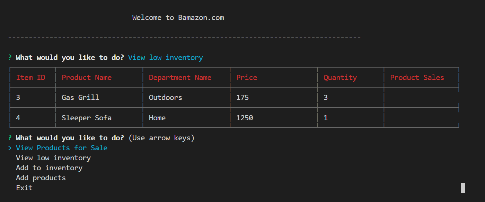
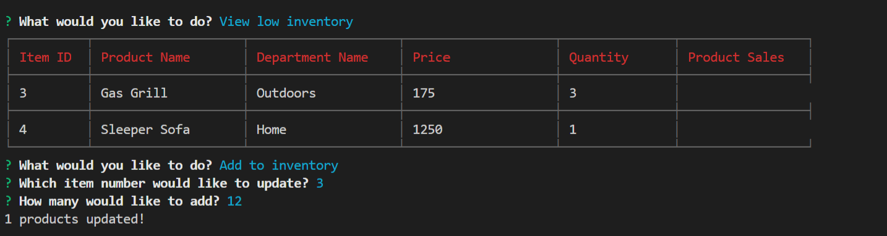
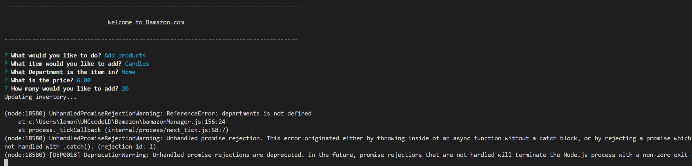
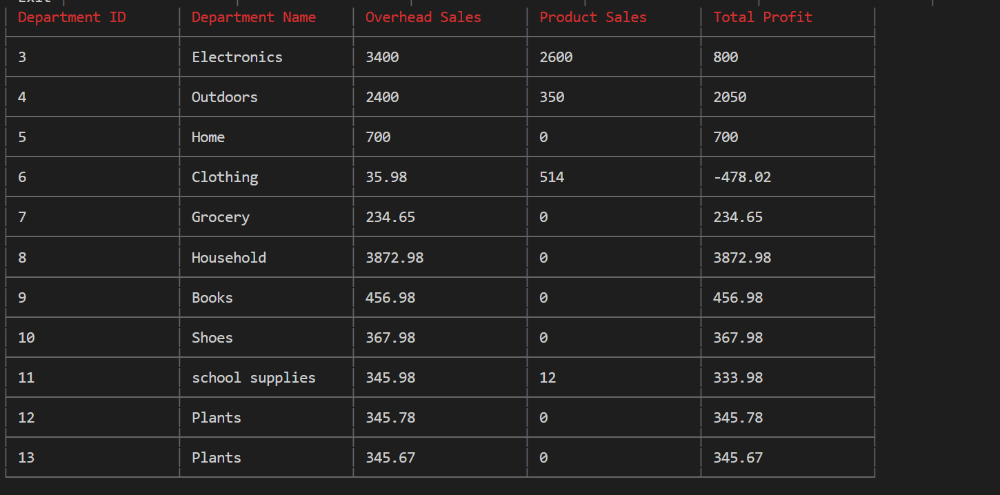
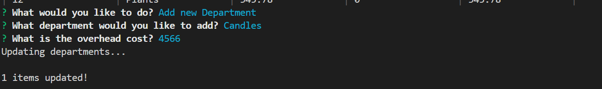

# Bamazon.com

## Introduction

> Bamazon is an Amazon-like storefront using MySQL and JavaScript to allow customers to order products, managers to view reports on product sales and replinish products as needed, and supervisors to view overall department sales add new departments.

## GitHub repo 
https://github.com/lamanaml/Bamazon

### NPM's used
mysql

inquirer

cli-table

### Bamazon Customer
>The customer view first shows the customer all of the products in inventory then promps them to purchase a product.  

>Products are out of stock

>Products successfully ordered

### Bamazon Manager
>View Low Products

>Replinish low inventory

>>one small issue, it set the new inventory value to the number that you add (instead of adding to it) See comments in code

>Add new products 

>>This should add brand new products...  It worked before I added the department info which was required for the supervisor view.  Now it gives an error that departments is not defined.

      
### Bamazon Supervisor
>View sales by dept

>>This view should total the sales for the categories, but it only shows saless for one product in the category.  See comments in code.

>Add new department

>>I was able to successfully add a new department, but was not able to join it with the products table. 

> Outcome

Overall, this project was very challenging but interesting.  I think my biggest issues was trying to read and update in the same function.  For example, reading the department_id from departments and adding it to a new product. 
     
