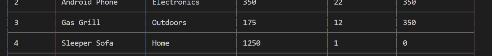

# Bamazon.com

## Introduction

> Bamazon is an Amazon-like storefront using MySQL and JavaScript to allow customers to order products, managers to view reports on product sales and replinish products as needed, and supervisors to view overall department sales add new departments.

## GitHub repo 
https://github.com/lamanaml/Bamazon

### NPM's used
mysql

inquirer

cli-table

### Bamazon Customer
>The customer view first shows the customer all of the products in inventory then promps them to purchase a product.  

>Products are out of stock

>Products successfully ordered

### Bamazon Manager
>View Low Products

>Add replinish low inventory

one small issue, it set the new inventory value to the number that you add (instead of adding to it)

>Add new products

      
### Bamazon Supervisor
>Add replinish low inventory

>Add replinish low inventory

     
